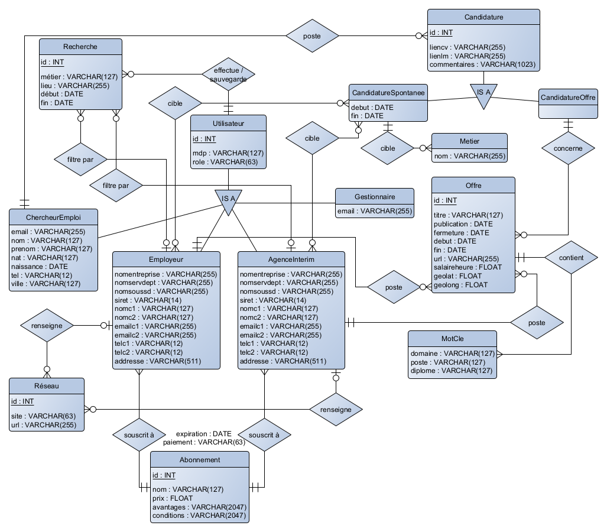
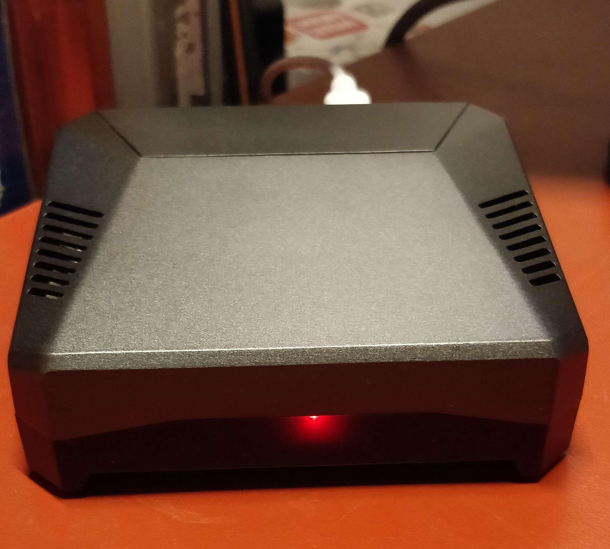

+++
author = "Hugo Authors"
title = "Interim appliction - M1"
date = "2023-01-01"
description = "Interim application using Android Studio"
tags = [
    "Docker",
    "Java",
    "Android Studio",
    "Raspberry pi"
]
categories = [
    "Android",
    "Java",
    "Master",
]
series = ["Themes Guide"]
aliases = ["migrate-from-jekyl"]
image = "app.png"
+++

[Lien GitLab](https://gitlab.com/rainbowsuperloki/application-interim-hai811i.git)

## Description

This project is an Android application for consulting, 

Ce projet est une application Android pour consulter, postuler et gérer ses candidatures sur des offres d'emplois.

## Introduction

Ce projet est une application Android qui permet à un utilisateur soit de créer ses annonces soit de pouvoir postuler. Une gestion de candidatures est présente : un employeur peut consulter les candidatures qu'il a reçu ou un chercheur d'emploi peut consulter les informations qu'il a entré (CV, Lettre de motivation, etc).

## Démo 



### Connexion/Inscription/Modification de compte



La connexion à la base de données de l’application permet à l’utilisateur de se connecter avec
une adresse email et un mot de passe. Il lui suffit de sélectionner le rôle qui lui correspond, d’entrer
son mail et son mot de passe utilisateur dans les champs correspondants pour accéder à la page
de profil correspondante.
La connexion d’un utilisateur est maintenue entre les lancements de l’application. Elle ne s’ar-
rête que lorsque l’utilisateur se déconnecte manuellement depuis sa page de profil. Cette connexion
est gérée par un système de jetons de connexion, qui conserve l’identifiant et le rôle de l’utilisateur
connecté.

S’il ne possède pas de compte, l’utilisateur peut également s’inscrire depuis la page de profil. Il
lui suffit alors de renseigner les informations correspondantes selon son statut : s’il est chercheur
d’emploi, employeur ou représentant d’une agence d’intérim. Il lui faudra ensuite renseigner un
mot de passe et le confirmer, avant que les requêtes correspondant à la création de compte soient
envoyées.

Dans le cadre de la gestion des utilisateurs, l’application permet aux utilisateurs de modifier
leurs informations personnelles. Cette fonctionnalité est accessible depuis la page de Profil des
utilisateurs, qui affiche toutes les informations liées à l’utilisateur via un appel à la base. Cette
page permet à l’utilisateur de consulter ces informations, mais également d’accéder à la page de
modification du profil. Les pages Mon profil et modification de profil s’adaptent également en fonction de l’utilisateur,
ainsi les Employeurs auront une page plus complète avec les informations correspondantes. Le
formulaire de modification est adapté au type d’utilisateur. Afin de faciliter la vie de l’utilisateur, les champs de la page de modification de profil sont
préremplis via une requête SQL avec les valeurs actuelles présentes dans la base. Cela évite à
l’utilisateur de devoir recopier toutes ses informations personnelles s’il souhaitait seulement, par
exemple, ajouter son nouveau numéro de téléphone. Cette approche plus ergonomique allège signi-
ficativement la modification du profil pour l’utilisateur.

### Profil



Selon qu’il est connecté ou non et selon son rôle, un utilisateur verra apparaître des pages de
profil différentes qui correspondent le mieux à ses permissions. Parmi les options présentées ci-dessus, les options Aide à la candidature et A propos de nous
sont communes aux trois rôles d’utilisateur. Ces pages sont essentiellement informatives et ne
comprennent aucune caractéristique technique

### Abonnements



Lorsqu’un nouvel utilisateur s’inscrit, l’application va lui demander de choisir un type d’abonne-
ment pour pouvoir utiliser Interima. Il en existe 6 différents, avec des avantages et un tarif associé.
Le choix de l’abonnement est enregistré dans la base avec l’utilisateur qui lui est associé, et après
avoir cliqué sur l’abonnement qu’il désire l’utilisateur est emmené sur une page de confirmation
qui résume les caractéristiques et le tarif de son abonnement et lui permet de confirmer le choix
de l’abonnement. Bien entendu, dans le cadre de notre projet d’étudiant, cette étape n’exige pas
de réel moyen de paiement.

### Annonces



#### Tri des annonces en fonction de la géolocalisation

Un utilisateur anonyme va voir en priorité les annonces les plus proches de sa position géogra-
phique, s’il active la géolocalisation de son appareil sur l’application. La position de l’utilisateur
est traquée via la permission d’accès à la géolocalisation de l’appareil. Une fois la position mise
à jour, la distance entre l’utilisateur et les offres est calculée via les valeurs de longitude et de
latitude, puis elles sont triées pour afficher en premier les offres à proximité. Passé le tri initial,
les annonces sont mises à jour toutes les 10 secondes, si la position de l’utilisateur a changé d’au
moins 10 mètres.

#### Recherches par mot clé

Nous avons implémenté un système de recherche par mots clé. Ce système est fonctionnel depuis
la page de recherche de notre application, accessible via la barre de navigation présente en bas de
chaque page. Un utilisateur connecté peut accéder à son historique des recherches.

#### Partage d'annonce

Un utilisateur anonyme peut partager une annonce depuis la page principale, depuis la page
de recherche ou depuis la page complète d’une annonce. Pour l’instant, seul le partage par SMS
possède une véritable logique métier.

#### Publication d'annonce

La publication d’une annonce est une fonctionnalité réservée aux utilisateurs de type Em-
ployeur. Ainsi, l’activité de création d’offres n’est disponible que pour les utilisateurs de type
Employeur. e choix de la date de début et de fin de l’offre utilisent un DatePickerDialog. es valeurs de longitude et latitude permettront de répertorier l’offre dans l’espace et de la
recommander aux intérimaires proches. Malgré une tentative d’utiliser une API de Google pour
déterminer la latitude et longitude à partir d’une adresse, nous avons eu des difficultés et l’implé-
menter et choisi de requérir la latitude et la longitude directement.

#### Favoris

Notre application supporte un système de favoris qui permet aux utilisateurs de marquer les
offres qui les intéressent, par exemple pour pouvoir candidater plus tard s’ils n’ont pas le temps
de s’en occuper pour le moment. Pour favoriser une offre, un utilisateur de l’application clique sur le bouton marque-pages de
l’annonce qui l’intéresse.

### Candidatures



#### Envoi/réutilisation

Un chercheur d’emploi peut candidater à une annonce depuis la liste des annonces, puis depuis
la page complète de l’annonce choisie. En cliquant sur le bouton Candidater de cette dernière, le
chercheur d’emploi est alors face à un choix : soit il peut rédiger une toute nouvelle candidature, soit
il peut réutiliser les informations (notamment le CV et la lettre de motivation) d’une candidature
précédent.

#### Gestion des candidatures

Un chercheur d’emploi peut consulter ses candidatures depuis la page Mes candidatures de
son profil. Pour chacune des candidatures, l’option Consulter permet de consulter la candidature
entière ; on retrouve alors le titre de la candidature, le lien vers le CV et la lettre de motivation.

En revanche, un employeur ou une agence d’intérim peuvent consulter les candidatures qu’elles
reçoivent des chercheurs d’emploi qui ont candidaté à leurs annonces. En plus de pouvoir consulter
le détail de ces candidatures, elles peuvent également décider de l’accepter ou de la refuser.

#### Partage

Il est possible via notre application de partager une candidature via SMS.  Pour l’instant, seul le partage par SMS
possède une véritable logique métier.

## Cahier des charges

Dans le cadre de ce projet, nous avons été soumis à un cahier des charges. Parmi les fonctionnalités imposées par le cahier des charges, nous dressons une liste des fonctionnalités que nous
avons implémentées lors de ce projet :

+ consultation des annonces en détail
+ recherche d’annonces par mot clé
+ connexion et inscription utilisateur
+ page de profil
+ partage d’annonces, de candidatures
+ pages d’informations : aide à la candidature, section "A propos"
+ fonctionnalités pour chercheur d’emploi :
+ envoi d’une candidature sur une annonce ou candidature spontanée
+ réutilisation d’une candidature
+ consultation des candidatures envoyées
+ consultation des CV et lettres de motivation associées aux candidatures
+ consultation de l’historique des recherches
+ mise en favoris d’annonces
+ fonctionnalités pour employeur :
+ publication d’annonces via formulaire
+ consultation des offres publiées
+ gestion des candidatures reçues sur les annonces (consultation, confirmation, refus)
+ fonctionnalités pour agence d’intérim :
+ publication d’annonces via formulaire et envoi de fichier JSON
+ consultation des offres publiées
+ gestion des candidatures reçues sur les annonces (consultation, confirmation, refus)

## Base de données sur Raspberry Pi et Docker

Notre base de données suit le schéma suivant : 

Pour que notre base de données soit accessible depuis n’importe quel appareil, nous devions trouver un moyen de la mettre en ligne. La démarche que nous avons choisi est d’utiliser un Raspberry Pi 4 qui fait tourner une image de MySQL avec Docker. 

Une configuration sur les volumes était nécessaire. En effet, la base de données pourrait s’arrêter suite à un problème de synchronisation avec une plateforme telle que Docker. Il nous faut alors des données persistantes, d’où l’utilité de créer des volumes. Les ports d’entrée et de sortie sont aussi spécifiés pour pouvoir faire les redirections correctement.

Une fois que la base de données était fonctionnelle, il fallait configurer son accès depuis l’extérieur. Tout d’abord, dans le fichier SQL de création de la base, un utilisateur avec les droits de gestion a été créé pour pouvoir faire les différentes requêtes de gestion (insertions, mises à jour, ...). Ensuite, afin de pallier le problème des addresses IP dynamiques d’un modem, nous avons mis en place un DNS avec No-Ip. Ce site permet de récupérer les adresses IP d’une box Internet qui l’envoie à intervalles réguliers.

