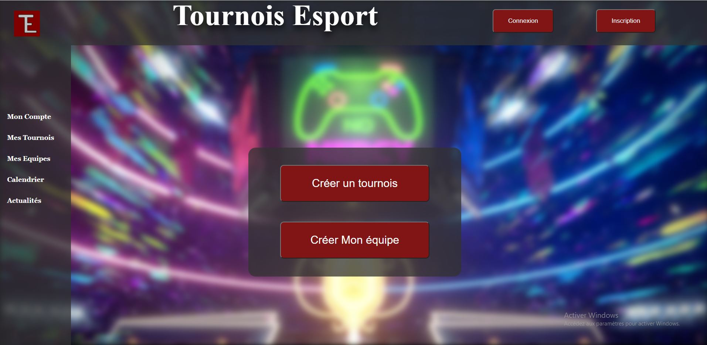
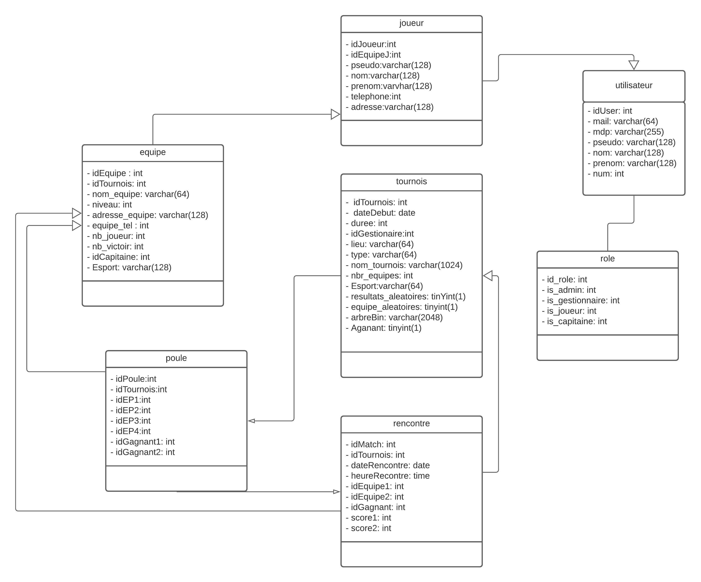
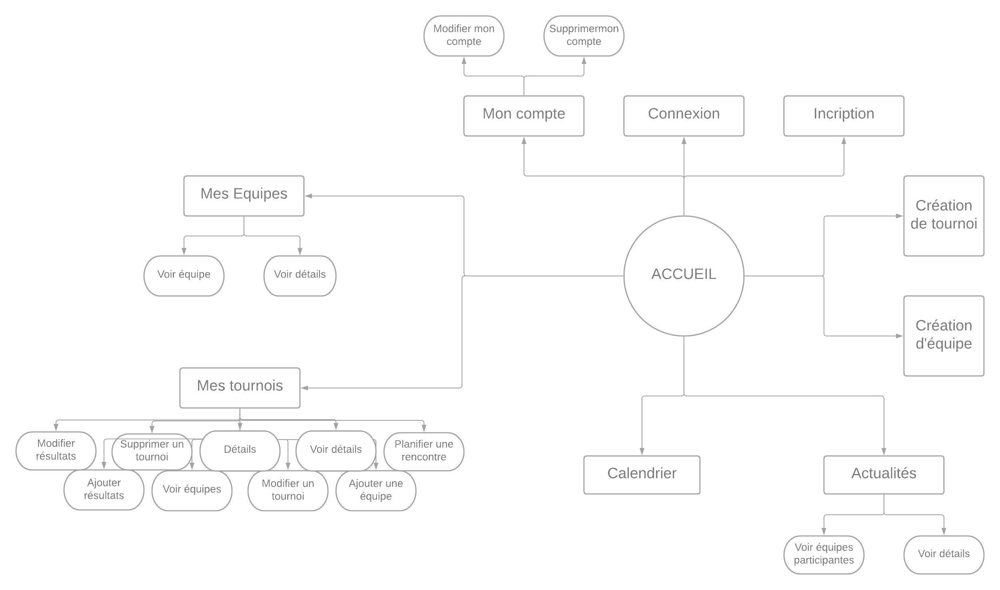

+++
author = "Océane Ongaro"
title = "Projet L2 - Tournoi Sportif"
date = "2021-01-01"
description = "Projet de L2"
tags = [
    "PHP",
    "CSS",
    "HTML",
    "JS",
    "SQL",
]
categories = [
    "Web",
    "Licence",
]
series = ["Themes Guide"]
aliases = ["migrate-from-jekyl"]
image = "accueil.JPG"
+++

[Lien GitLab](https://gitlab.com/AlyssaShep/tournoi-sportif-reupload.git)

## Introduction

Ce site web permettait l'organisation manuelle de compétitions Esport (coupe, championnat, etc).

## Description

Le but de ce projet était de faire un site de gestionnaire de tournoi sur le sujet de notre choix en utilisant du PHP et d'autres technologies. Nous avons choisi le thème de l'Esport.

## Navigation

### Connexion/Inscription

Evidemment, pour accéder à toutes les fonctionnalités, il faut être un utlisateur connecté. Nous avons les pages de connexion et d'inscription.



### Page d'accueil

Nous avons commencés à implémenter la page d’accueil.
En tant que page principale, elle doit permettre d’accéder à diverses autres pages.
Nous avons donc intégré une "Sidebar" et un "Header", qui sont d’ailleurs affichés sur
la plupart des autres pages principales. Le Header permet de se connecter, se déconnecter,
ou de s’inscrire.
La Sidebar quant à elle permet d’accéder aux paramètres de compte, aux tournois, aux
équipes, ainsi qu’à l’actualité et à un calendrier.

### Création de tournois/équipes

Pour les pages de création d’équipes et de tournois, nous avons notamment utilisé des
scripts en JavaScript, pour restreindre et adapter les différents paramètres d’équipes et de
compétitions en fonction de l’Esport choisi et du type de tournois.



### Calendrier

L’une des fonctionnalité particulière du site que nous avons développé est un calendrier
permettant d’afficher chacune des compétitions, soit sous la forme d’un calendrier mensuel,
hebdomadaire ou encore sous la forme d’une liste. Un code couleur permet de différencier
les compétitions passées, en cours et a venir.
Afin d’implémenter ce calendrier, il a été nécessaire d’utiliser un plugin JQuery : Full-
Calendar. L’une des principales difficultés avec ce dernier a été la gestion du visuel, ainsi
que la personnalisation du calendrier. La façon de procéder est assez différente et se
fait majoritairement dans le script du calendrier, ou encore dans le fichier récupérant les
données.
En effet, afin de permettre au plugin d’afficher les informations présentes dans la base de
donnée, il a fallut les récupérer et les renvoyer au script a l’aide de la fonction json_ encode
sans laquelle il était impossible d’afficher les informations.



### Actualité

L'onglet actualité permet de consulter les tournois en cours. Nous avons toutes les informations nécessaire tel que la date de début, la durée, le gestionnaire ou autres. 

## Mise en place

### Outils

Avant toute réalisation, nous avons fait le design pour avoir une conduite de projet esthétique précise. Mon rôle dans ce projet était essentiellement le BackEnd mais c'est transformé en FullStack en donnant un coup de main au FrontEnd. J'avais aussi géré le dépôt Git en créant tout d'abord un GitFlow classique. 

Nous avons créer une base de données avec plusieurs entités (Joueur, Equipe, Utilisateur,...). Ces entités permettait d'avoir des comportements différents. Pour commencer à développer au mieux notre site, nous avons installé sur nos ordinateurs
respectif Wamp ou Xamp (selon le système d’exploitation de chacun).
Le but étant d’éviter en premier lieu de se connecter à un serveur externe, et, ainsi nous
permettre de bénéficier de serveurs nécessaires à la visualisation du site (Ex : Interpréteur
de script)

Ce projet n'a pas utilisé de framework pour le front et tout a été fait par notre équipe.

### Schématisation de la base de données

### Récapitulatif

